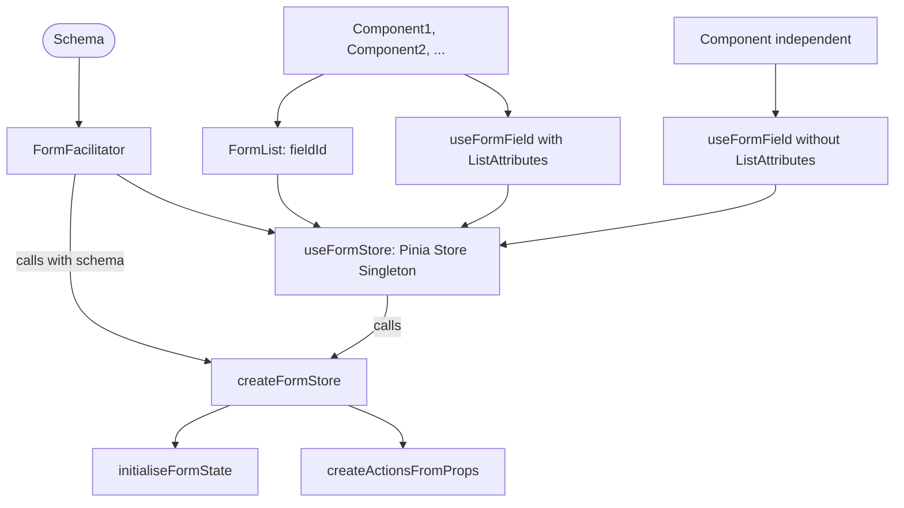

# wins-common-form-component-v3

## Architecture Overview



## Recommended IDE Setup

[VSCode](https://code.visualstudio.com/) + [Volar](https://marketplace.visualstudio.com/items?itemName=Vue.volar) (and
disable Vetur)

+ [TypeScript Vue Plugin (Volar)](https://marketplace.visualstudio.com/items?itemName=Vue.vscode-typescript-vue-plugin).

## Type Support for `.vue` Imports in TS

TypeScript cannot handle type information for `.vue` imports by default, so we replace the `tsc` CLI with `vue-tsc` for
type checking. In editors, we
need [TypeScript Vue Plugin (Volar)](https://marketplace.visualstudio.com/items?itemName=Vue.vscode-typescript-vue-plugin)
to make the TypeScript language service aware of `.vue` types.

If the standalone TypeScript plugin doesn't feel fast enough to you, Volar has also implemented
a [Take Over Mode](https://github.com/johnsoncodehk/volar/discussions/471#discussioncomment-1361669) that is more
performant. You can enable it by the following steps:

1. Disable the built-in TypeScript Extension

1) Run `Extensions: Show Built-in Extensions` from VSCode's command palette
2) Find `TypeScript and JavaScript Language Features`, right click and select `Disable (Workspace)`

2. Reload the VSCode window by running `Developer: Reload Window` from the command palette.

## Customize configuration

See [Vite Configuration Reference](https://vitejs.dev/config/).

## Project Setup

```sh
npm install
```

### Compile and Hot-Reload for Development

```sh
npm run dev
```

### Type-Check, Compile and Minify for Production

```sh
npm run build
```

### Run Unit Tests with [Vitest](https://vitest.dev/)

```sh
npm run test:unit
```

### Lint with [ESLint](https://eslint.org/)

```sh
npm run lint
```

[Unplugin Vue Components](https://github.com/antfu/unplugin-vue-components)
no need for import / component registration

## Function: createInputComponent(componentName, componentOptions)

Creates a new Vue.js component based on provided name and options.

**Parameters:**

- `componentName`: (type: string) The name of the component to be created.
- `componentOptions`: (type: object) The options to configure the new component. Default value is an empty object. The
  object can contain the following properties:
    - `newProps`: An object that specifies additional props to be added to the component.
    - `newListeners`: An object that specifies additional listeners to be added to the component.
    - `validateOn`: An array of string events upon which validation should be triggered. Make sure the component's API
      supports the listed events (e.g., 'onBlur', 'onChange', etc.).
    - `watchers`: An array of functions that observe and respond to changes on the component. Each watcher function will
      receive `fieldStateAndHandler` as input.

**Returns:**

A new Vue.js component configured based on the provided parameters.

**Usage Example:**

```javascript
const NewComponent = createInputComponent('NewComponentName', {
    newProps: {
        prop1: value1,
        prop2: value2
    },
    newListeners: {
        listener1: function1,
        listener2: function2
    },
    validateOn: ['onBlur', 'onChange'],
    watchers: [watchFunction1, watchFunction2]
});
```

**Notes:**

The new component automatically hooks up with `useFormField` composable to get field state and handlers. If the new
component is used within a form list, the list's ID should be provided via Vue's inject mechanism, and the component
will automatically recognize and deal with list-specific attributes. Component's validation method can be extended to
emit a 'validated' event or deferred to submit time, depending on `validateOnSubmit` prop.

___

# Form Generation

## Function: createFormStore(storeProps)

`createFormStore` is a function that creates a new store for form management using the Pinia library. It initializes
form state, error states, and actions based on the provided schema.

**Parameters:**

- `storeProps` (type: StoreProps): An object that includes the schema and dependency for the form.

**Returns:**

A Pinia Store object that includes the form state, error states, actions, and any provided dependencies.

**Throws:**

If `storeProps` is not provided, the function will throw a `MissingStorePropsError`.

**Usage Example:**

```javascript
const formStore = createFormStore({schema: mySchema});
```

**Dependencies:**

- `initialiseFormState`: This function is used to initialize the form state based on the provided schema. It iterates
  over the schema and assigns default values for each field. Additionally, it sets `validateCount` to 0.

- `createActionsFromProps`: This function is used to generate form actions based on the provided schema. It iterates
  over the schema and creates appropriate setter methods for each field. It also provides specific actions for list
  schemas like 'addIdx' and 'removeIdx' to manage form list items.

---

## Function: initialiseFormState(schema)

**Parameters:**

- `schema` (type: GroupSchema): An object that defines the structure and properties of the form.

**Returns:**

An object representing the initial state of the form.

---

## Function: createActionsFromProps(schema, formState, errorStates)

**Parameters:**

- `schema` (type: any): An object that defines the structure and properties of the form.
- `formState` (type: any): An object representing the current state of the form.
- `errorStates` (type: any): An object representing the error states of the form.

**Returns:**

An object with setter methods for each form field and actions to manage list items. It also includes a `validateForm`
function to increment `validateCount` and trigger validation.

**Notes:**

- The `createFormStore` function is designed to work with forms defined using a specific schema structure. Please ensure
  your form schema adheres to the expected structure.
- The function expects to be used within a Vue 3 setup context that is using Pinia for store management.

---

# Composables

## Function: useFormFieldWatch(targetKey, handler)

The `useFormFieldWatch` function is a factory function that creates a watcher on a specified key in the field's state.
The created watcher function will be triggered whenever the specified state changes. The function leverages
Vue's `watch` API to create the watcher.

**Parameters:**

- `targetKey`: (type: string) The key in the field's state to be watched. This key should exist within the
  WatchableStates derived from the `FieldStateAndHandlers`.
- `handler`: (type: function) The function to be triggered whenever the state changes. This function is called with an
  object containing both the field's state and props.

**Returns:**

A function (FieldTargetWatchFunction) that when invoked, creates a Vue watcher. This returned function expects two
parameters: `watchableStates` (object that includes the field's state) and `props` (the component's props).

**Usage Example:**

```javascript
const watchValue = useFormFieldWatch('value', () => {
    // This is the function that will be triggered whenever the 'value' state changes.
    console.log('Value has changed');
});

// To use the watcher, call the returned function with the watchableStates and props.
watchValue(watchableStates, props);
```

**Notes:**

The `useFormFieldWatch` function only works with the states that are Vue Refs, hence the type `WatchableStates`. This
means that any primitive or non-reactive properties of the field's state cannot be watched with this function.

Positive Aspects:

- Separation of Concerns: There is a clear distinction between different parts of the system, such as the form
  facilitator, Pinia store, form list, and individual components.
- Reusability: The components like Component1, Component2, etc., and the form list can be used independently or within
  the context of a FormList, providing flexibility.
- Singleton Pattern for Store: Using useFormStore to facilitate a singleton pattern for the form store ensures that
  there is a single source of truth for the form state.

- Potential Improvements and Considerations:

- Complexity: The architecture has multiple layers of abstraction and interconnections, which might lead to increased
  complexity. Ensuring good documentation, clear naming conventions, and possibly breaking down some functions into
  smaller parts can alleviate this.

- Error Handling: From the code and diagram, it's not immediately clear how errors are handled across different parts of
  the architecture. Robust error handling mechanisms should be implemented and documented.

- Performance Considerations: The use of watchers, especially with validation, needs to be carefully optimized to
  prevent unnecessary recalculations and rerenders. Profiling and optimizing these parts could be beneficial.

- Dependency Injection: Consider dependency injection for shared services or functions, which might make testing and
  maintenance easier.

- Testing: Unit tests should be comprehensive and cover all the critical paths of the application. Writing tests can
  sometimes reveal architectural weaknesses or areas that could be refactored for clarity and robustness.

- Type Safety: It seems like there's good use of TypeScript in defining types like ListAttributes. Ensure that types are
  used consistently across the application to improve maintainability and reduce runtime errors.

---
